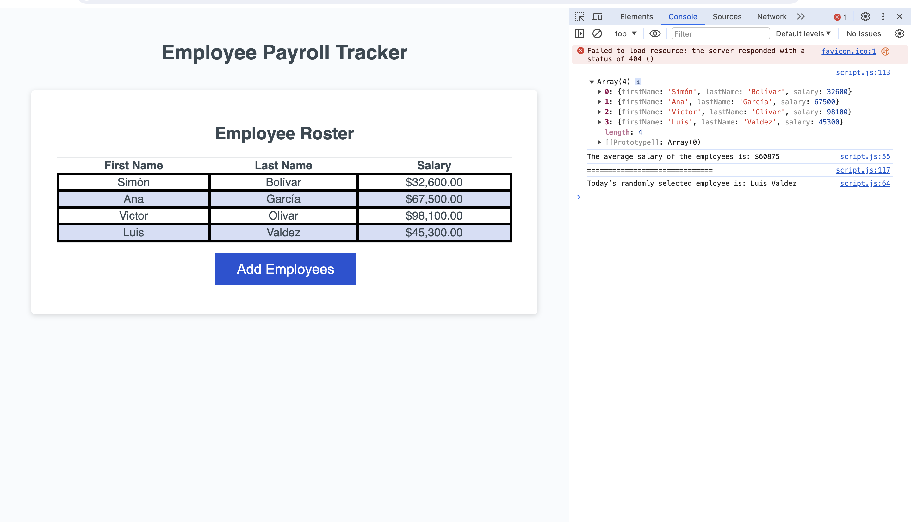

# Bootcamp module three challenge

## Description

In this project I used JavaScript to make a given website interactive and perform its duties. The starter code that a was given contained all the HTML and CSS elements the site needs for its structure and style, but the JavaScript file did not had all of its functions implemented yet. So I implemented the remaining functions to make the site work as planned.

This project was interesting, because I had to analyze the Javascript code that another developer made. The good thing was that the code had helpful comments on it, so it was relatively easy to understand. This showed me the importance of comments in code, since it helps fellow developers comprehend someone’s work.

## Installation

No installation is required, you can click the following link to access the site: https://eduardovela2022.github.io/Bootcamp-module-three-challenge/

## Usage

- When you access the website by clicking the following link: https://eduardovela2022.github.io/Bootcamp-module-three-challenge/. You will be greeted by the homepage of the website.
  

- To use the website you should click on the “Add Employees” button. When you click the button, a popup box will appear telling you to enter the first name of an employee.
  

- Once you enter an employee’s first name, another popup box will tell you to enter the last name of said employee.
  

- After you enter the employee’s last name, another popup will tell you to enter the salary of said employee.
  

- Once you enter the employee’s salary, another popup box will ask you if you want to add another employee. If you click on the “OK” button, the website will ask you for the first name, last name and salary of another employee, but if you click on the “Cancel” button the website will show you all of the employees you have entered thus far in a table, ordered alphabetically by their last name.
  

- Here is an example of a table comprised of four employees:
  

- But that is not all, if you open the developer tools in your Chrome Browser, by right clicking on the webpage and choosing the inspect function of the menu, and go to the console section of the developer tools, you will see that the website computed the average salary of all the employees, and it selected a random employee. You can also see the order in which the employees were added to the website, by clicking on the array object present on the console.
  
  

- And those are all the features of the website.

## Credits

I used the following websites to complete the project:

- Mozilla. (n.d.). Math.random(). MDN Web Docs. https://developer.mozilla.org/en-US/docs/Web/JavaScript/Reference/Global_Objects/Math/random
- W3schools. (n.d.). Javascript Number Isnan(). JavaScript Number isNaN() Method. https://www.w3schools.com/jsref/jsref_isnan_number.asp#:~:text=isNaN()%20returns%20true%20if,a%20number%20before%20testing%20it.
- W3schools. (n.d.). JavaScript Popup Boxes. JavaScript popup boxes. https://www.w3schools.com/js/js_popup.asp

## License

This project uses the MIT license.
